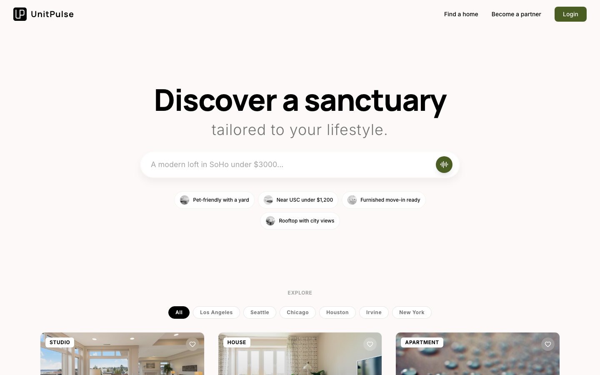

<div align="center">

</div>

# UnitPulse — AI-Powered Rental Search

A renter-facing rental search SPA. The pitch: instead of filling out filters,
you describe what you want in plain language and an AI (Google Gemini) returns
a curated shortlist with a "lifestyle match" rationale. Users can also browse
properties traditionally — chat is one entry point, not the only one.

**Live (staging):** https://unitpulse-ai-rental-search.vercel.app/

---

## Documentation map

This README covers install + what's in the box. The full project context for
contributors and AI agents lives in:

- **[CLAUDE.md](./CLAUDE.md)** — cold-start guide: tech stack details, design
  tokens, URL hierarchy, AI feature flags, conventions, known tripwires,
  migration plan to the AWS production repo. **Start here** if you're new
  to the codebase.
- **[TODO.md](./TODO.md)** — every deferred decision and revival recipe:
  AI feature flags still to wire, URL hierarchy Phase 2, sitemap/robots/
  llms.txt, property FAQ data API, editorial content, etc.
- **[design.md](./design.md)** — prose-level brand and surface usage.
- **[PRD.md](./PRD.md)** — original product spec.

---

## Tech stack

- **React 19** + TypeScript
- **Vite 6** (dev server + build)
- **Tailwind CSS v3** via PostCSS plugin (`tailwind.config.js`,
  `postcss.config.js`) — semantic tokens, not raw hex
- **react-router-dom v7**
- **motion** (`motion/react`, formerly framer-motion)
- **Google Gemini** (`@google/genai`) — chat + Live (voice) APIs
- **Supabase REST** for property data
- **lucide-react** (icons)

---

## Quick start

```bash
# 1. Install
npm install

# 2. Set the only required env var
cp .env.example .env.local
# add your GEMINI_API_KEY (https://aistudio.google.com/app/apikey)

# 3. Run dev server
npm run dev          # http://localhost:3000
```

To test the production scenario (all AI flags off — traditional browse + filter
without AI surfaces):

```bash
cat >> .env.local <<EOF
VITE_FEATURE_AI_CHAT=false
VITE_FEATURE_AI_VOICE=false
VITE_FEATURE_AI_LIFESTYLE_MATCH=false
VITE_FEATURE_AI_PREFERENCES=false
EOF
# restart dev server — flags load at start, not at runtime
```

See `.env.example` for the full list of flags. See
[CLAUDE.md → AI features status](./CLAUDE.md#ai-features-status-read-before-touching)
for what each one gates.

---

## What's in the app

### Routes

- `/` — landing with hero, search input, 8 trending properties, "Browse all" CTA
- `/listings` — full property grid with city filter
- `/search?q=...` — keyword search results (when `AI_CHAT` is off)
- `/search/:chatId` — conversational AI search (when `AI_CHAT` is on)
- `/{state}` — state hub (e.g. `/ca`)
- `/{state}/{city}` — city hub with editorial content, neighborhoods, market stats
- `/{state}/{city}/{slug}` — canonical property detail page
- `/property/:id` — legacy property URL (301s to canonical)
- `/favorites`, `/blog`, `/faq`, `/rentals`, `/privacy`, `/terms`, `/partner`

The state/city/slug hierarchy is part of an ongoing SEO/GEO restructure; see
[CLAUDE.md → URL hierarchy](./CLAUDE.md#url-hierarchy-canonical-phase-1)
for the full plan and the Phase 2 pieces still pending.

### AI features (gated by flags)

- **Conversational search** (`AI_CHAT`) — natural-language property search via
  Gemini, "Lumina" concierge persona, structured JSON output, multi-thread
  history, suggested-reply chips.
- **Voice search** (`AI_VOICE`) — Gemini Live API, real-time transcription.
- **Lifestyle Match** (`AI_LIFESTYLE_MATCH`) — AI-generated rationale on each
  property detail page explaining why it fits.
- **Preference intelligence** (`AI_PREFERENCES`) — behavioral tracking +
  preference synthesis from chat history.

All AI features ship in code but tree-shake out of the production bundle when
their flag is `false`. To verify: `npm run build && grep -r 'gemini' dist/`
should return nothing if all four flags are off.

### Property pages

- Photo grid, full details, amenity list, floor plans, building amenities
- Map / nearby section
- **Property-level FAQ section** with 14 templated Q&As across 5 categories
  (Pricing, Location, Amenities, Tours & Leasing, Pet Policy) and `FAQPage`
  JSON-LD schema markup. Mock data — see TODO.md for the data API spec.
- Sticky tour/inquire CTA footer
- Share + favorite controls in the breadcrumb row (page mode) or floating
  over the photos (chat-panel mode)

### Other

- **Renter profile** with gamified preference completion (when `AI_PREFERENCES`
  is on). Levels Lv.1–5 from "Casual Browser" to "Dream Home Hunter".
- **Favorites** — toggle from any card; persisted to `localStorage`; login-
  gated with deferred-apply.
- **Mock auth** — login always succeeds. Real auth is a TODO.
- **Toast notification system** with action buttons.
- **Blog**, **FAQ**, **Privacy**, **Terms**, **Partner** static pages.

---

## Project structure

```
/
├── App.tsx                       # Route table
├── index.html, index.tsx         # Entry
├── index.css                     # Tailwind base/components/utilities + a few globals
├── tailwind.config.js            # Brand tokens (single source of truth for colors)
├── postcss.config.js             # PostCSS plugin registration
├── featureFlags.ts               # AI feature-flag definitions
├── urlHelpers.ts                 # State/city/slug helpers + getPropertyUrl()
├── types.ts                      # Shared TypeScript types
├── constants.ts                  # MOCK_PROPERTIES seed data
├── pages/
│   ├── LandingPage.tsx
│   ├── AllListingsPage.tsx       # Browse-all grid + city filter
│   ├── SearchResultsPage.tsx     # Keyword search (AI off)
│   ├── ChatPage.tsx              # Conversational search (AI on)
│   ├── PropertyPanel.tsx         # Property detail in chat-side-panel mode
│   ├── PropertyDetailPage.tsx    # Property detail as standalone page
│   ├── StateIndexPage.tsx        # /:state hub
│   ├── CityIndexPage.tsx         # /:state/:city hub with editorial
│   ├── BlogPage.tsx, BlogPostPage.tsx
│   ├── FAQPage.tsx
│   ├── RentalMarketsPage.tsx
│   ├── CityRentalPage.tsx        # Legacy /rentals/:city — being absorbed by CityIndexPage
│   ├── PartnerPage.tsx
│   ├── PrivacyPage.tsx, TermsPage.tsx
│   └── SearchRedirect.tsx        # /search → /search/:newChatId helper
├── components/
│   ├── PropertyCard.tsx
│   ├── PropertyDetailsView.tsx   # Property detail body (used in both modal and page modes)
│   ├── ChatInterface.tsx         # Chat UI, message list, stop button, input
│   ├── LiveInterface.tsx         # Voice mode (Gemini Live API)
│   ├── RenterProfilePopover.tsx  # Gamified preference profile
│   ├── ContactFormModal.tsx      # Tour scheduling / contact form
│   ├── FavoritesPage.tsx
│   ├── TopNav.tsx                # Site header with sticky-scroll variants
│   ├── PageFooter.tsx
│   ├── Toast.tsx
│   └── partner/                  # Partner-page subcomponents
├── services/
│   ├── propertyService.ts        # Supabase REST + Property mapping
│   ├── geminiService.ts          # Gemini chat integration + mock fallback
│   ├── preferenceSynthesizer.ts  # Behavioral preference extraction
│   ├── tracker.ts, sessionService.ts, syncService.ts
│   └── supabaseClient.ts
├── hooks/
│   └── useTracker.ts             # Behavioral event hooks
├── context/
│   └── AppContext.tsx            # Favorites, threads, preferences (localStorage)
└── public/                       # Static assets, screenshots
```

---

## Engineering follow-ups

The deferred-work register lives in **[TODO.md](./TODO.md)**. Major items:

- AI feature flags — wire `AI_PREFERENCES` (light touch — `useTracker` no-op)
- URL hierarchy Phase 2 — add `stateCode`, `citySlug`, `neighborhoodSlug`,
  `slug` as first-class fields on the property model; add neighborhood
  index page; add programmatic `(neighborhood × property-type)` pages
- `sitemap.xml`, `robots.txt`, `llms.txt` at production cutover
- Property FAQ data API (replace `buildMockFAQs`)
- Editorial content for state/city pages (currently templated)
- Real property data feed (replace stock photos with operator-uploaded ones)
- Component primitives (`<Button>`, `<Chip>`, `<Card>`)
- Real auth backend (login is currently a no-op)

---

## Deployment

Today: pushes to `main` auto-deploy to Vercel staging (Hobby plan; commits
must be authored as `Zhen Wang <zhen.wang@unitpulse.ai>` to be accepted).

Production: AWS, owned by engineering. The migration plan is documented in
[CLAUDE.md → Migration to the AWS repo](./CLAUDE.md#migration-to-the-aws-repo).

---

## License

Proprietary — all rights reserved.
